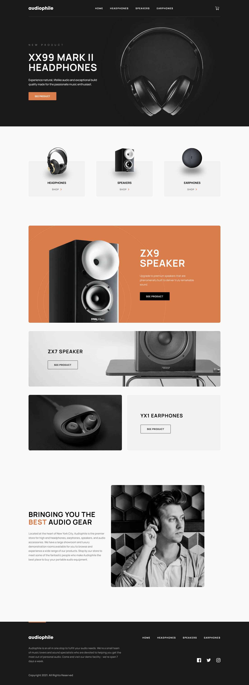

# Frontend Mentor - Audiophile e-commerce website solution created by chr-dev(Chatcharin Rangsisawat)

This is a solution to the [Audiophile e-commerce website challenge on Frontend Mentor](https://www.frontendmentor.io/challenges/audiophile-ecommerce-website-C8cuSd_wx). Frontend Mentor challenges help you improve your coding skills by building realistic projects.

## Table of contents

- [Overview](#overview)
  - [The challenge](#the-challenge)
  - [Screenshot](#screenshot)
  - [Links](#links)
- [My process](#my-process)
  - [Built with](#built-with)
  - [What I learned](#what-i-learned)
  - [Continued development](#continued-development)
- [Author](#author)

## Overview

### The challenge

Users should be able to:

- View the optimal layout for the app depending on their device's screen size
- See hover states for all interactive elements on the page
- Add/Remove products from the cart
- Edit product quantities in the cart
- Fill in all fields in the checkout
- Receive form validations if fields are missed or incorrect during checkout
- See correct checkout totals depending on the products in the cart
  - Shipping always adds $50 to the order
  - VAT is calculated as 20% of the product total, excluding shipping
- See an order confirmation modal after checking out with an order summary
- **Bonus**: Keep track of what's in the cart, even after refreshing the browser (`localStorage` could be used for this if you're not building out a full-stack app)

### Screenshot

### Links

- Solution URL: https://github.com/auychat/Audiophile-Ecommerce
- Live Site URL: https://audiophile-ecommerce-chrdev.vercel.app/

## My process

### Built with
- [Next.js](https://nextjs.org/) - React framework
- [Tailwind CSS](https://tailwindcss.com/) - Tailwind CSS for styles
- [Formik](https://formik.org/) - Formik for form input management
- [Yup](https://github.com/jquense/yup) - Yup for form validation

### What I learned

**1. Absolute vs. Relative Positioning:**
I learned the importance of understanding the difference between absolute and relative positioning in CSS. This knowledge allowed me to precisely control the layout and placement of elements on our website, ensuring a visually pleasing and functional design.

**2. Responsive Condition Rendering:**
I discovered the significance of responsive design and how to implement condition-based rendering for various screen sizes and device types. This skill enabled us to create a seamless user experience across a range of devices, from desktop computers to mobile phones.

**3. Formik and Yup:**
I delved into the Formik library for handling forms and Yup for form validation. These tools streamlined the process of collecting user input and ensuring its accuracy, resulting in a more user-friendly and error-resistant interface.

**4. State Management in Cart and Local Storage:**
Understanding state management became crucial when dealing with shopping cart functionality. I learned how to effectively manage the state of items in a user's cart and how to save this data to local storage, allowing for a persistent shopping experience even after a page refresh.

**5. Next.js Route Slug:**
I explored Next.js and the use of route slugs to create dynamic and SEO-friendly URLs. This knowledge improved our website's overall search engine optimization and made it easier for users to navigate and share specific product pages.

### Continued development

As part of the ongoing development for the Audiophile E-commerce project, I will be establishing a back-end infrastructure. This backend will be designed to manage user data, product listings, and transaction records within a database.

It's important to note that this full-stack environment will be implemented exclusively for demonstration purposes and will not be configured for production use.

## Author

- Frontend Mentor - [@auychat](https://www.frontendmentor.io/profile/auychat)
- Linkedin Profile - [@Chatcharin](https://www.linkedin.com/in/chatcharin-rangsisawat-9b42ba184/)

